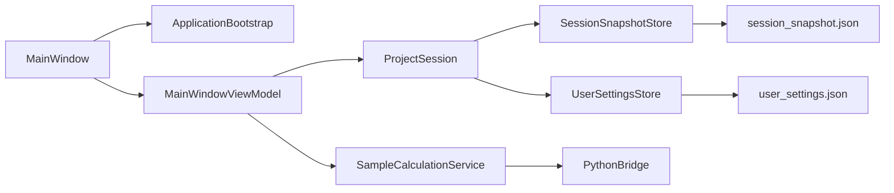
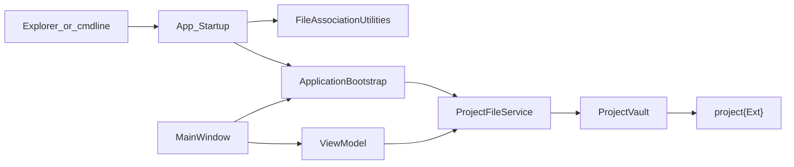

# 架构地图（zoom-out）

## 分层与依赖

| 路径 | 职责 |
|------|------|
| `View/` | XAML 与 code-behind：布局、路由事件、绑定 |
| `ViewModel/` | 可绑定属性、命令；调用 Services，不直接持久化 |
| `Services/` | 计算编排、Python 桥、校验、路径 |
| `Model/` | 工程文档、表访问、序列化 |
| `{Abbr}Py/` | Python Driver 与表目录读写 |
| `{Abbr}Env/` | 可移植 Python 环境（发布运行时，禁止 venv/pyvenv.cfg） |
| `Assets/Baseline/` | 新建工程默认 JSON 表种子 |

依赖方向：`View → ViewModel / Services / Model`；`ViewModel → Services / Model`；`Services → Model`。**禁止** `Model → View / ViewModel`。

## 调用链

```mermaid
flowchart LR
  UI[View_MainWindow] --> VM[ViewModel]
  UI --> Svc[SampleCalculationService]
  Svc --> Session[ProjectSession]
  Session --> Export[ExportWorkspace]
  Export --> Ws[Temp_{Abbr}Work_GUID]
  Svc --> Bridge[PythonBridge]
  Bridge --> PyExe["{Abbr}Env/python.exe"]
  PyExe --> Driver[CalculateDriver.py]
  Driver --> Ws
  Svc --> Merge[MergeTablesFromWorkspace]
  Merge --> Session
  Session --> Vault[ProjectVault]
  Vault --> Disk["project{Ext}"]
```

## GeoPile 对照（蒸馏来源）

| 通用模板 | GeoPile 原名 |
|----------|--------------|
| `{Abbr}Py` | `GPPy` |
| `{Abbr}Env` | `GPEnv` |
| `{ABBR}_WORKSPACE` | `GEOPILE_WORKSPACE` |
| `ProjectSession` | `LiveProject` |
| `ProjectFileFormat` | `GpdxFormat` |
| `project{Ext}` | `.gpdx` |

## 模块清单（脚手架最小集）

| 文件 | 职责 |
|------|------|
| `Themes/DefaultTheme.xaml` | 色板与全局 TextBox/Button 样式 |
| `Resources/` | 图标/背景/字体目录骨架 |
| `Properties/` | Settings + Resource.resx |
| `CompositionRoot.cs` | DI |
| `PythonBridge.cs` | 子进程与环境变量 |
| `ProjectSession.cs` | memory 或 archive 分叉模板 |
| `SessionSnapshotStore.cs` | memory：快照读写（含 uiState） |
| `UserSettingsStore.cs` | AppData 偏好（WindowPlacement） |
| `FileAssociationUtilities.cs` | archive：HKCU `{Ext}` 关联 |
| `App.xaml.cs` | archive：`Application_Startup` 与命令行打开 |
| `.dual-stack-persistence.json` | 当前 persistence 标记 |

## 持久化分叉

见 [persistence-modes.md](persistence-modes.md)、[persistence-wiring.md](persistence-wiring.md)、[ui-state-contract.md](ui-state-contract.md)。

### memory — 双文件 AppData 子图



| 模块 | 职责 |
|------|------|
| `SessionSnapshotStore` | 业务表 + `uiState.statusText` |
| `UserSettingsStore` / `WindowPlacementSettings` | 窗口 Width/Height/Left/Top/State |
| `ApplicationBootstrap` | 启动协调、几何读写 |
| `ProjectSession.BuildUiState` | 构造写入 snapshot 的 uiState |

### archive — 工程包链

`ProjectSession` → `ProjectVault` → `project{Ext}`（见 persistence-modes）。



| 模块 | 职责 |
|------|------|
| `App.xaml.cs` | `Application_Startup`；解析 `{Ext}` 命令行；创建 MainWindow |
| `FileAssociationUtilities` | HKCU 注册双击打开 |
| `ApplicationBootstrap.ConfigureStartupProjectPath` | cmdline 工程优先于最近路径 |
| `ProjectFileService` | Open/Save/SaveAs |
| `ProjectVault` | ZIP 读写 |

**后续项（未纳入模板）**：GeoPile 式同路径多实例锁（`GpdxFileSessionLock`）。
