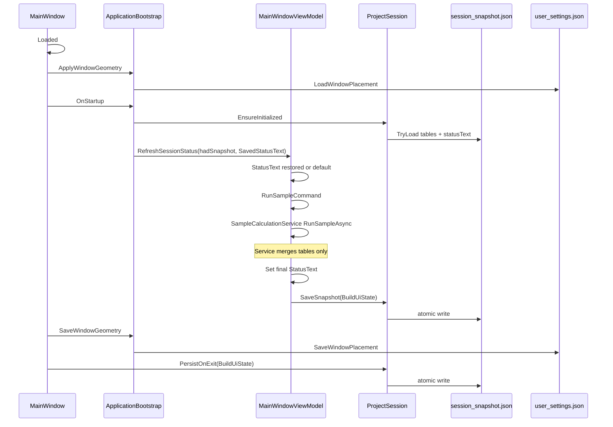
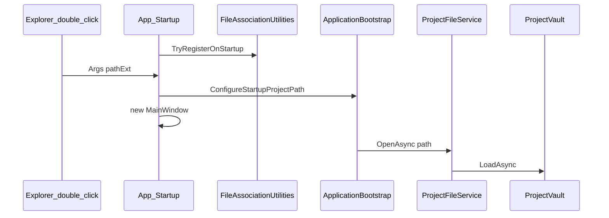

# 持久化运行期接线手册

Scaffold 不仅复制持久化**类**，还须保证下列调用链在目标项目中已接通。详见 [ui-state-contract.md](ui-state-contract.md)。

## memory 模式 — 启动 / 计算 / 关窗



## archive 模式 — 启动 / 双击打开 / 落盘

| 阶段 | 行为 |
|------|------|
| 启动 | `Application_Startup`（**非** `StartupUri`）→ `FileAssociationUtilities.TryRegisterOnStartup`；解析 `e.Args` 中 `{Ext}` → `ConfigureStartupProjectPath` → 优先 `OpenAsync`；否则 `TryOpenLastProjectAsync` |
| 计算 | Export → Driver → Merge → `MarkDirty()` |
| 用户落盘 | 文件菜单 / **Ctrl+S** → `ProjectVault` |
| 关窗 | 脏且已有路径 → 自动 Save |
| 窗口布局 | `Loaded` + `user_settings.json` |



### archive 必检文件

| 文件 | 必含逻辑 |
|------|----------|
| `App.xaml` | `Startup="Application_Startup"`，**无** `StartupUri` |
| `App.xaml.cs` | `TryGetStartupProjectFilePath`；手动 `new MainWindow()` |
| `Services/FileAssociationUtilities.cs` | HKCU `{Ext}` → `"exe" "%1"` |
| `ApplicationBootstrap.cs` | `ConfigureStartupProjectPath`；cmdline 优先于最近工程 |
| `MainWindow.xaml` | `Grid` 首行 `Menu` + `DefaulMenuBackground`；`KeyBinding` Ctrl+S |
| `MainWindow.xaml.cs` | form-demo：`CommitTextBoxBindings` + `FlushPendingFormEdits` |

运行 `audit_project.py --expect archive` 可静态核对。

### form-demo-archive 接线（`--include-form-demo` + archive）

| 组件 | 职责 |
|------|------|
| `SessionFormData` | VM 六字段 ↔ `dataTables["测试表单"]` |
| `MainWindowViewModel` | 编辑 → `SyncFormToSession` + `MarkDirty`；Save/Ctrl+S 写 zip |
| `MainWindow.xaml.cs` | 关窗 `CommitTextBoxBindings` + `FlushPendingFormEdits` |

### archive 手动 F5 清单

1. F5 一次 → 注册 `.ast` 关联（或运行 `inspect_file_association.py --check`）。
2. 填写六框 → **Ctrl+S** 另存为 `{Ext}`。
3. 资源管理器 **双击** 该文件 → 程序启动且表单恢复。
4. `verify_persistence_artifacts.py --mode archive --require-form-demo` 通过。

`migrate_persistence_mode.py --import-last-snapshot` 会在项目目录生成 `sample_import{Ext}` 供脚本验收。

---

## archive 用户项目验收

## 必检文件（memory）

| 文件 | 必含逻辑 |
|------|----------|
| `MainWindow.xaml.cs` | `Loaded` → `ApplyWindowGeometry`；关窗 `SaveWindowGeometry` + `PersistOnExit(BuildUiState)` |
| `ApplicationBootstrap.cs` | `LoadWindowPlacement` / `SaveWindowPlacement`；`OnStartup` 传 `SavedStatusText` |
| `SessionSnapshotStore.cs` | `TryLoad` 解析 `uiState.statusText` |
| `UserSettingsStore.cs` | `WindowPlacementSettings` |
| `ProjectSession.cs` | `BuildUiState`、`SavedStatusText` |
| `MainWindowViewModel.cs` | 启动优先 `savedStatusText`；计算后带 uiState 写快照 |
| `SampleCalculationService.cs` | **无** `SaveSnapshot` 调用 |

运行 `audit_project.py --expect memory` 可静态核对上述项。

---

## AgentStatistics 夹具 E2E（memory — Phase B 冻结）

**禁止手改** AgentStatistics 夹具工程；memory 仅通过 reset/scaffold 更新。`$proj` 应指向当前仓库内的测试夹具路径。

archive（`.ast`）为 **Phase C 补充轨**，见下文「AgentStatistics archive 补充验收」；与 memory 互不覆盖。

### E2E 前：Agent 缓存 intake

```powershell
py -3 scripts/inspect_appdata_cache.py --app-id AgentStatistics --check
```

见 [agent-cache-intake.md](agent-cache-intake.md)。

### Scaffold + 脚本验收

```powershell
# 从 skill 根目录执行：wpf-python-mvvm-builder
# 如果 AgentStatistics 夹具不在默认相对位置，按实际位置调整该路径。
$proj = "..\..\测试专用\AgentStatistics"

py -3 scripts/reset_agent_statistics_fixture.py --project-dir $proj --apply
py -3 scripts/scaffold_dual_stack.py --project-dir $proj --abbr AS --persistence memory `
  --app-id AgentStatistics --root-namespace AgentStatistics --display-name "Agent Statistics" `
  --include-form-demo --apply
py -3 scripts/smoke_bridge.py --project-dir $proj --abbr AS
py -3 scripts/memory_persistence_smoke.py --project-dir $proj --abbr AS --app-id AgentStatistics `
  --display-name "Agent Statistics" --include-form-demo
py -3 scripts/verify_persistence_artifacts.py --mode memory --app-id AgentStatistics `
  --require-sample-result --require-ui-state --require-window-settings --require-form-demo
py -3 scripts/audit_project.py --project-dir $proj --abbr AS --expect memory
dotnet build $proj/AgentStatistics.csproj
```

### form-demo 自动保存接线（`--include-form-demo`）

| 组件 | 职责 |
|------|------|
| `SessionFormData` | VM 字段 ↔ `dataTables["测试表单"]` JSON |
| `MainWindowViewModel` | 编辑防抖 500ms → `SaveSnapshot`；启动 `LoadFormFromSession` |
| `MainWindow.xaml.cs` | 关窗 `CommitTextBoxBindings` + `FlushPendingFormEdits` |

### 手动 F5 清单（脚本无法覆盖 WPF 窗口）

1. F5 → 填写**测试表单**六个文本框 → 等 ~0.5s 或直接关窗。
2. 再次 F5 → **文本框内容**与上次一致。
3. 拖大/移动窗口 → 样本计算 → 退出 → 再开 → **窗口 + 状态栏**一致。
4. `session_snapshot.json` 含 `测试表单` 且 `projectName` 等可解析（`verify --require-form-demo`）。

---

## AgentStatistics archive 补充验收（Phase C）

不 reset memory。前置：已 migrate 或直 scaffold archive + `--include-form-demo`。

```powershell
py -3 scripts/run_agent_statistics_archive_e2e.py --project-dir $proj --abbr AS
py -3 scripts/inspect_file_association.py --ext .ast --prog-id AgentStatistics.ProjectFile --check
```

见 [SKILL.md](../SKILL.md) Phase C。

---

## archive 用户项目验收

```powershell
py -3 scripts/scaffold_dual_stack.py --project-dir "<user-path>" --persistence archive --ext ".gpdx" ... --apply
dotnet build ...
# 手动：文件 → 另存为 → 退出 → 打开 → 表数据一致
py -3 scripts/verify_persistence_artifacts.py --mode archive --archive-path "<path>.gpdx"
```

---

## 相关文档

- [persistence-modes.md](persistence-modes.md) — 模式对照与迁移
- [ui-state-contract.md](ui-state-contract.md) — uiState / WindowPlacement 字段契约
- [architecture-map.md](architecture-map.md) — 分层与模块地图
